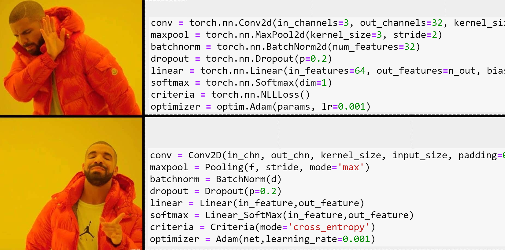

# Convolution neuron network from scratch
This notebook implement a mini deep learning frame-work in the style of pytorch. Everything here from RELU, Batch Norm, Softmax, ...  are implemented from scratch. 

The network declaration is similar to pytorch. 

    class CNN:
        """
        Typical pytorch style network declaration.
        """
        def __init__(self, in_shape, out_size):

            in_size = in_shape[0]
            in_chn = in_shape[-1]

            conv1_channel = 12
            self.convo1 = Conv2D(in_chn=in_chn, out_chn=conv1_channel, kernel_size=3, in_shape=in_shape, padding=1, stride=2, bias=False)

            c1 = (in_size-3 + 2*1)//2 + 1
            output_shape = (c1,c1,conv1_channel)

            self.batchnorm1 = BatchNorm(output_shape)

            conv2_channel = 2*conv1_channel
            self.convo2 = Conv2D(in_chn=conv1_channel, out_chn=conv2_channel, kernel_size=3, in_shape=output_shape, padding=1, stride=2, bias=False)

            c2 = (c1-3 + 2*1)//2 + 1
            output_shape = (c2,c2,conv2_channel)

            self.batchnorm2 = BatchNorm(output_shape)

            self.flatten = Flatten()

            linear_in = np.prod(output_shape)

            self.linear_softmax = Linear_SoftMax(linear_in, out_size)

            # only layers with trainable weights here, which are used in optimization/gradient update.
            self.layers = {'convo1': self.convo1, 'batch_norm1': self.batchnorm1, 'convo2': self.convo2, 
                           "batch_norm2": self.batchnorm2, 'linear_softmax': self.linear_softmax}

        def forward(self, X):

            X = self.convo1.forward(X)
            X = self.batchnorm1.forward(X)

            X = self.convo2.forward(X)
            X = self.batchnorm2.forward(X)

            X = self.flatten.forward(X)
            X = self.linear_softmax.forward(X)

            return X

        def backward(self, dZ):

            dZ = self.linear_softmax.backward(dZ)
            dZ = self.flatten.backward(dZ)

            dZ = self.batchnorm2.backward(dZ)
            dZ = self.convo2.backward(dZ)

            dZ = self.batchnorm1.backward(dZ)
            dZ = self.convo1.backward(dZ)

            return dZ

        def set_weights(self, weight_list):
            for k, (W,b) in weight_list.items():
                self.layers[k].W = W
                self.layers[k].b = b

        def get_weights(self):
            return {k:(layer.W, layer.b) for k,layer in self.layers.items()}

        def get_dweights(self):
            return {k:(layer.dW, layer.db) for k,layer in self.layers.items()}

